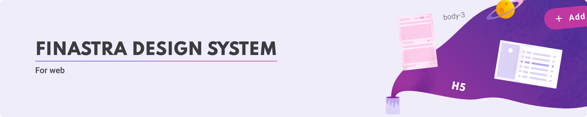
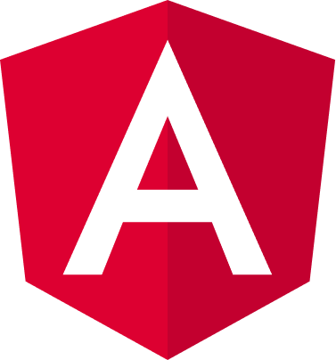

# Choose your flavor

    

        <h2>Web components</h2>
        
    

    

        <h2>Angular</h2>
        
    

# Useful links

- [Finastra design system website](https://design.fusionfabric.cloud/)
- [Finastra on Figma](https://www.figma.com/@finastra)

Following monorepo is composed of several assets :

- [Angular Material theme (Finastra branded)](./themes/angular-theme/README.md)
- [Angular components](./libs/angular-components/README.md)
- [Test Angular Application showcasing the above](https://lucid-bassi-bfa8cc.netlify.app/)
- [Modern CSS version of our Theme](./themes/fds-theme/README.md)
- [Web Components](./libs/web-components/README.md)
- [Power BI theme (Finastra branded)](./themes/power-bi-theme/README.md)

## Want to help ? 🤗❤️

Want to file a bug, contribute some code, or improve documentation?
Excellent!

If it's your first time contributing, use the tag 