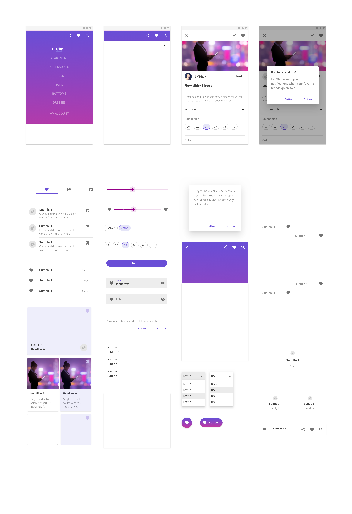

# Finastra Design System

Following monorepo is composed of several assets :

- [Angular Material theme (Finastra branded)](https://github.com/finastra/finastra-design-system/tree/master/themes/angular-theme)
- [Angular components](https://github.com/finastra/finastra-design-system/tree/master/libs/angular-components)
- [Test Angular Application showcasing the above](https://github.com/finastra/finastra-design-system/tree/master/apps/angular-test-app)
- [Power BI theme (Finastra branded)](https://github.com/finastra/finastra-design-system/tree/master/themes/power-bi-theme)

## Want to help ? 🤗❤️

Want to file a bug, contribute some code, or improve documentation?
Excellent!

If it's your first time contributing, use the tag 
