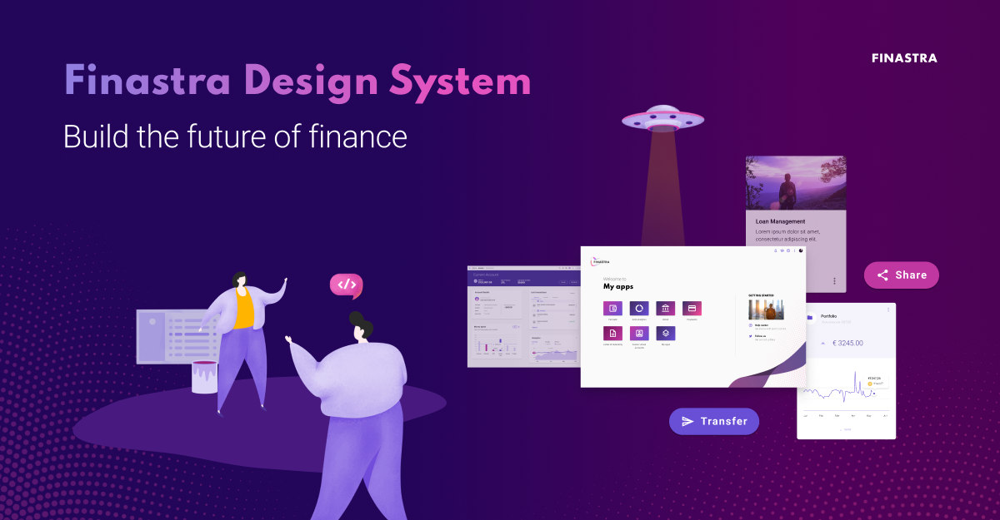

Welcome to the Finastra Design System repository. You will find here all the assets and ressources to **build applications quickly and consistently**. It will also help you easily applying **Finastra branding and UX best practices**. 

# 🌍 For web

## Web theme

`@finastra/fds-theme`

Our web theme is built over modern CSS standards and provides all foundations (colors, typography, elevations, spacings) to apply Finastra branding. It provides light/dark mode support out of the box and target WCAG AA accessibility rating.

[Learn more](./packages/fds-theme-web/README.md)

## Web components

This implementation of the Finastra design system is framework agnostic (i.e can be used with any major framework: React, Vue, Angular, Svelte...). It's our futureproof solution for adopting [Finastra branded components](https://finastra.github.io/finastra-design-system/) in your financial app. It uses the web theme.

[Learn more](./packages/fds-components-web/README.md)

# 📦 Other resources

## UI kit on Figma

It all starts here for designers. The source of thruth for foundations and components. Useful for developers when looking for accurate specifications. Finastra UX & Design team provides also other ressources on Figma such as ideation tools.

[Learn more](https://www.figma.com/@finastra)

## Power BI theme

A Microsoft Power BI theme specified in JSON.

[Learn more](./packages/fds-theme-powerbi/README.md)

## Finastra Design System page

Please note that due to dissolving the Finastra UXG team the [Finastra design system](https://design.fusionfabric.cloud/) web site will be closed down by the end of October 2023. However, this repository will stay alive thanks to the engagement of the community members.

# 💌 Want to help?

Want to file a bug, contribute some code, or improve documentation?
Excellent! Consider reading our [contribution guidelines](./CONTRIBUTING.md).
