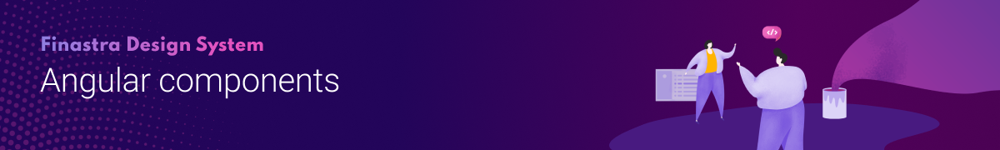

[](https://www.npmjs.com/package/@finastra/angular-components)
[](https://stackblitz.com/@ffdcbot)

The Finastra Angular components are the Angular implementation of the [Finastra Design System](https://design.fusionfabric.cloud). It features Finastra's branding of components (global search, data visualization, repeater, filters...).

## 🤔 How to use it? 

You can get started in 3 simple steps:

Install the dependency (Note that the Angular components require our [Angular Material theme](https://www.npmjs.com/package/@finastra/angular-theme).

```Bash
npm install @finastra/angular-components
```

Import the required component in your project

```Javascript
import { ScrollToTopModule } from '@finastra/angular-components/scroll-to-top';
…
@NgModule ({…
    imports: […,
    ScrollToTopModule,
…]
})
```

Add the component in your HTML like so

```HTML
<uxg-scroll-to-top></uxg-scroll-to-top>
```

## 💌 Want to help?

Want to file a bug, contribute some code, or improve documentation?
Excellent! Consider reading our [contribution guidelines](../../CONTRIBUTING.md)
