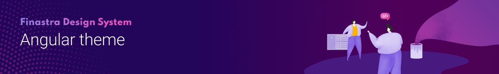

[](https://www.npmjs.com/package/@finastra/angular-theme)
[](https://stackblitz.com/@ffdcbot)

The Finastra Angular Theme is the Angular implementation of the [Finastra Design System](https://design.fusionfabric.cloud). It features Finastra's branding of foundations (color, typography, icons, logo) and UI elements (buttons, checkbox, input...).

## 🤔 How to use it?

You can get started in 2 simple steps:

Install the dependencies

```Bash
npm install @finastra/angular-theme @angular/material
```

### With SASS

The most flexible way of using the angular-theme

```SCSS
@use '@finastra/angular-theme' as fds;
@use '@finastra/angular-theme/base';

@include fds.uxg-core();
@include fds.uxg-material-theme(fds.$light-theme);
```

### With CSS pre-built themes

Choose between `light`, `dark` or `all-theme`

```SCSS
@import '@finastra/angular-theme/prebuilt-theme/all-theme';
```

## 💌 Want to help?

Want to file a bug, contribute some code, or improve documentation?
Excellent! consider reading our [contribution guidelines](../../CONTRIBUTING.md)
